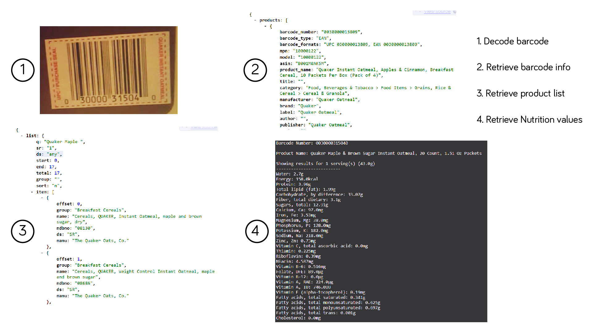

# Food-Tracker
Food Tracker tracks down a food item's nutritional values using the product's bar code, it then has the option to allow the user to evaluate their daily hypothetical and actual nutrition intake. 

## The Process

1. Scan and decode barcode images using the library pyzbar.
2. Look for product's information using the barcode API, provided by [Barcode Lookup](https://www.barcodelookup.com/).
3. Look for list of products related to the product's description, provided by [USDA](https://ndb.nal.usda.gov/ndb/).
4. Compile and finalize product's nutritional values.
5. Determine recommended nutrition intake, provided by FDA.
    - [Vitamins + Minerals](https://www.accessdata.fda.gov/scripts/InteractiveNutritionFactsLabel/factsheets/Vitamin_and_Mineral_Chart.pdf) 
    - [Other nutrients](https://www.accessdata.fda.gov/scripts/InteractiveNutritionFactsLabel/pdv.html)
6. View and track nutrition intake.

## Map of the program's process:

## Files Description

* `program.py` - Imitate user usage of the program.
* `fxn.py` - Manage data analysis and data conversion.
